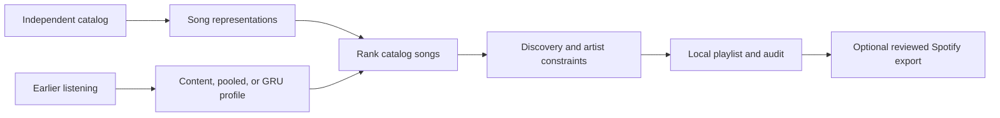

# TasteLab

**An inspectable music recommendation lab in Python: compare content and deep learning models, predict the next observed song, and compose playlists with explicit discovery controls.**

[Start learning](docs/START_HERE.md) · [Technical walkthrough](docs/LEARN.md) · [Real dataset](docs/LARGE_DATA.md) · [Results](docs/results/README.md) · [GitHub setup](docs/GITHUB.md)

TasteLab runs locally with PyTorch and includes a small fictional teaching demo plus a much larger experiment on public ListenBrainz listening records. Spotify is an optional destination for a reviewed playlist; it is not the ML data source.

## What it does

- Compares popularity, content/artist matching, pooled two-tower, GRU two-tower, and a validation-selected hybrid.
- Learns from earlier listening and evaluates on later observations.
- Supports sampled candidate training for a larger catalog, with full-catalog ranking on explicitly sampled evaluation queries.
- Builds playlists with unheard-artist minimums, per-artist caps, duplicate/dislike exclusion, and inspectable score adjustments.
- Shows how rankings change when recent input observations are withheld.
- Provides teaching notebooks, exercises, source checks, test coverage, and a reproducible dataset pipeline.
- Optionally exports a manually reviewed track mapping to a private Spotify playlist.

## Architecture



The item tower represents songs. The query tower represents listening history. Their dot product ranks candidates. The GRU processes history in order; mean pooling does not. A separate playlist builder applies user constraints.

## Data at two scales

| | Fictional teaching demo | Real listening benchmark |
|---|---:|---:|
| Events used | 4,800 | **96,689** |
| Tracks | 192 | **47,403** |
| Listeners | 40 | **3,952** |
| Prepared dataset size | 298 KB | **11.88 MB** |
| Features | Generated genre and numeric attributes | Artist identity; audio attributes unavailable |
| Event signal | Generated completion and feedback | Recorded implicit listens |

The real-data importer scanned **6,141,997 records** from an official **293 MB compressed** ListenBrainz snapshot. It retained 235,728 recognized local-player/client submissions, removed duplicate and ambiguous timestamps, and selected the eligible catalog and listeners from training-period counts. The final benchmark is the retained subset above, not all scanned records.

User listen data is published under CC0 by [ListenBrainz](https://listenbrainz.org/download/). The importer excludes Spotify-labelled additional metadata and unrecognized source labels. Source labels are self-reported, and the dataset has selection biases. Read the [data card](docs/LARGE_DATA.md) for the checksum, full filtering counts, provenance, and limitations.

## Quick start

Python 3.12 is the tested version family; package metadata permits Python 3.11 and newer.

```bash
python3 -m venv .venv
source .venv/bin/activate
python -m pip install -e '.[dev,notebook,datasets]'

# Small, fast teaching experiment
tastelab demo
jupyter lab notebooks/01_taste_lab.ipynb
```

On Windows, activate with `.venv\Scripts\Activate.ps1` in PowerShell. A fresh clone needs installation and an initial demo run. Generated data, checkpoints, and virtual environments are excluded from Git. If you move the project folder, recreate its environment and reinstall the package so command paths remain valid.

## Run the real-data experiment

```bash
# Downloads, verifies, streams, filters, and prepares the official snapshot.
tastelab large-data --out data/listenbrainz --max-tracks 50000

# Train with 512 sampled candidate IDs per update.
# Evaluate 512 uniformly sampled queries per window against the full catalog.
tastelab train --data data/listenbrainz --out artifacts/listenbrainz \
  --epochs 6 --negative-samples 512 --max-eval-queries 512

jupyter lab notebooks/02_real_data.ipynb
```

The prepared workspace already has the dataset and saved run. Start with the real-data notebook to inspect them. Use new output directories when repeating an experiment; existing datasets and run manifests are protected from overwrite. Official incremental archives rotate, so exact snapshot availability can change. The source URL and checksum are recorded. See [reproduction details](docs/LARGE_DATA.md).

## Results


The [result card](docs/results/README.md) and machine-readable summaries give the measured results for both datasets. The real benchmark ranks the next retained-catalog listen, with 512 test queries sampled from a later period. Neural checkpoints and hybrid weight are selected on validation.

The fictional generator deliberately contains sequence patterns. Its GRU scores do not establish real-world performance. The real-data benchmark is a filtered observational study; its results do not establish enjoyment, causal discovery outcomes, or superiority over Spotify. Neither retrieval table evaluates the final constrained playlists.

## Try playlist controls

```bash
# The synthetic demo has generated energy attributes.
tastelab recommend --user u000 --size 20 --discovery 0.4 --artist-cap 2 \
  --energy-start 0.25 --energy-end 0.85

tastelab counterfactual --user u000 --drop-recent 10
```

The real-data notebook selects a pseudonymous listener and builds a playlist using that saved run. Energy steering is disabled for the real dataset because the input provides no energy measurements.

Discovery means a minimum fraction of tracks from unheard artists, not an exact ratio or a minimum number of distinct artists. The artist cap applies separately. Infeasible requests and achieved counts are reported in an adjacent audit file. Scores are relative ranking utilities, not calibrated like probabilities. Withholding history is input sensitivity analysis, not model unlearning.

## Learn and extend

Start with [six focused learning sessions](docs/START_HERE.md): trace a training example, rebuild a content profile, understand embeddings and the towers, inspect the GRU, evaluate future events, and explain playlist constraints. Each session includes a small task and a checkpoint.

The [technical guide](docs/LEARN.md) supplies equations and design choices. The [real-data guide](docs/LARGE_DATA.md) explains missing observations, train-only catalog selection, sampled training, and evaluation limits. Use the [experiment notes template](docs/EXPERIMENT_NOTES.md) to record your own changes.

Research extensions include informative preference questions, content-only new-item retrieval, user-controlled discovery tradeoffs, and delayed voluntary-replay outcomes. See the [roadmap](docs/IDEAS.md). For your own data, use the [independent data schema](docs/DATA_SCHEMA.md).

## Repository layout

```text
src/tastelab/
  data.py          Schema, validation, simulation, feedback
  datasets.py      Checksum-verified download and real-data preparation
  features.py      Attribute or artist features and baselines
  models.py        Item tower, pooled/GRU query towers
  experiment.py    Splits, training, checkpoint selection, evaluation
  recommend.py     Ranking, constraints, counterfactuals
  spotify.py       Optional OAuth and playlist writes
  cli.py           Runnable commands
notebooks/         Teaching and real-data walkthroughs
docs/              Learning guides, dataset cards, measured results
tests/             Offline tests and mocked integrations
.github/workflows/ Automated formatting, tests, and package build
pyproject.toml     Dependencies and installable package configuration
CONTRIBUTING.md    How to make and verify a change
```

## Verify and publish

```bash
python -m pytest -q
python -m ruff check src tests
python -m ruff format --check src tests
python -m build
```

GitHub Actions runs formatting, offline tests, and package-building checks on pushes and pull requests. Its hosted status is available after publication. The [GitHub guide](docs/GITHUB.md) explains how to connect and push the local repository.

Dependency ranges are in `pyproject.toml`; run summaries record relevant versions. This is not a complete dependency lock, and numerical results may vary across environments. Raw data, personal histories, model files, and environments remain local. Only reviewed aggregate results and charts are included in the repository.

## Spotify boundary

Spotify's developer policy restricts training on and ingestion of Spotify content into ML/AI models. This project does not use Spotify account history, audio, API metadata, or account exports as model inputs. [Developer policy](https://developer.spotify.com/policy)

The optional exporter joins a manually reviewed Spotify URI mapping only after local recommendation. It uses PKCE, private-playlist scope, and a receipt for confirmed writes. Integration tests use mocked responses; a live account flow has not been verified here. See [Spotify setup](docs/SPOTIFY.md). TasteLab is an independent educational project, not endorsed by Spotify.
